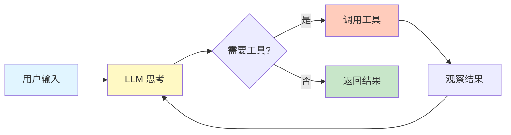
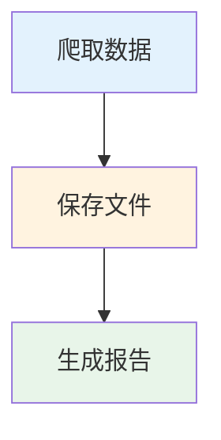

<div align="center">

# 🐵 Monkey Agent

**基于 ReAct 模式的模块化智能 Agent 框架**

<p>
  
  
  
</p>

</div>

---

## ✨ 核心特性

<table>
<tr>
<td width="50%">

### 🤖 ReAct 模式
自动执行**思考 → 行动 → 观察**循环，智能完成复杂任务

### 🛠️ 高度模块化
独立的 ReactLoop、ContextManager、ToolExecutor 组件

### 🎯 工作流调度
DAG 工作流自动编排，支持节点并行执行

</td>
<td width="50%">

### 💬 智能上下文
自动压缩对话历史，避免 token 超限

### 🔄 自动重试
工具执行失败指数退避重试，提高稳定性

### 🌐 浏览器自动化
基于 Playwright 的可靠浏览器控制

</td>
</tr>
</table>

## 🚀 快速开始

### 30 秒快速体验

```bash
# 安装核心包
npm install @monkey-agent/base @monkey-agent/llm
```

```typescript
import { BaseAgent, ToolBuilder } from '@monkey-agent/base';
import { LLMClient } from '@monkey-agent/llm';
import { z } from 'zod';

// 1. 创建自定义 Agent
class WeatherAgent extends BaseAgent {
  tools = [
      new ToolBuilder()
        .name('getWeather')
        .description('获取城市天气信息')
        .schema(z.object({ city: z.string() }))
      .execute(({ city }) => ({ temp: 22, conditions: '晴天' }))
        .build()
  ];
}

// 2. 使用 Agent
const agent = new WeatherAgent({
  id: 'weather-agent',
  name: '天气助手',
  llmClient: new LLMClient({
  provider: 'openai',
    apiKey: process.env.OPENAI_API_KEY,
  model: 'gpt-4o',
  }),
});

// 3. 执行任务（自动 ReAct 循环）
const result = await agent.execute(task);
console.log(result.summary);
```

### 使用完整系统（服务端 + Web UI）

```bash
# 1. 安装依赖
yarn install

# 2. 配置环境
cp server/env.example server/.env
# 编辑 server/.env 配置 LLM API Key

# 3. 启动服务（自动启动 Chrome + 服务端）
./scripts/start-dev.sh
```

访问 `http://localhost:3000` 开始使用 Web 界面。

## 🏗️ 架构概览

### ReAct 工作流程

Monkey Agent 基于 **ReAct (Reasoning + Acting)** 模式，通过思考-行动循环完成复杂任务：



### 模块化组件

每个组件独立可用，职责单一：

```
┌─────────────────────────────────────┐
│         BaseAgent (协调器)           │
├─────────────────────────────────────┤
│  ReactLoop      │ ReAct 循环执行    │
│  ContextManager │ 上下文管理 + 压缩 │
│  ToolExecutor   │ 工具执行 + 重试   │
│  ToolBuilder    │ 工具定义构建      │
└─────────────────────────────────────┘
```

### 核心组件简介

#### ReactLoop - ReAct 循环执行
自动执行思考 → 行动 → 观察循环，支持最大迭代次数限制

#### ContextManager - 智能上下文管理  
自动压缩对话历史（定期检查、智能触发），避免 token 超限

#### ToolExecutor - 工具执行 + 重试
指数退避重试机制（1s → 2s → 4s），提高工具调用稳定性

#### ToolBuilder - 流式工具定义
链式 API 简化工具定义，支持 Zod schema 验证

## 📦 内置 Agents

| Agent | 核心能力 | 工具数 | 典型场景 |
|-------|---------|--------|---------|
| **BrowserAgent** | 页面导航、元素操作、内容提取 | 9 | 网页自动化、数据采集 |
| **ComputerAgent** | 文件操作、Shell 命令、计算机控制 | 17 | 系统管理、文件处理 |
| **ChatAgent** | 自然语言理解、Workflow 生成 | 3 | 智能对话、任务规划 |
| **CodeAgent** | 代码执行（E2B Sandbox） | 5 | 代码运行、数据分析 |
| **ReportAgent** | 数据可视化、报表生成 | 4 | 图表生成、报告输出 |

> 💡 所有 Agent 都继承自 `BaseAgent`，自动获得 ReAct 能力、上下文管理、工具重试等特性

## 📁 项目结构

```
monkey-agent/
├── packages/                    # 🎯 核心业务逻辑（独立可复用）
│   ├── base/                   # ⭐ BaseAgent + 模块化组件
│   ├── agents/                 # 内置 Agents（browser、chat、code、system、report）
│   ├── llm/                    # LLM 客户端（Vercel AI SDK）
│   ├── orchestrator/           # 工作流编排器（DAG 调度）
│   ├── compression/            # 上下文压缩
│   ├── types/                  # 类型定义
│   └── utils/                  # 工具函数
│
├── server/                     # NestJS 服务端
├── web/                        # React Web UI
├── scripts/                    # 开发脚本
└── docs/                       # 📖 文档
```

## 🎯 使用示例

### 简单任务 - 网页操作

```typescript
const workflow = {
  id: 'simple-task',
  name: '打开网页',
  agentGraph: [{
      id: 'browser-1',
      type: 'browser',
      desc: '打开 https://www.baidu.com',
    steps: [{ stepNumber: 1, desc: '导航到百度' }],
    dependencies: []
  }]
};

await orchestrator.executeWorkflow(workflow);
```

### 复杂工作流 - DAG 多节点



```typescript
const workflow = {
  agentGraph: [
    { id: 'browser-1', type: 'browser', desc: '爬取数据', dependencies: [] },
    { id: 'file-1', type: 'file', desc: '保存数据', dependencies: ['browser-1'] },
    { id: 'file-2', type: 'file', desc: '生成报告', dependencies: ['file-1'] }
  ]
};

// 自动拓扑排序 + 并行执行
await orchestrator.executeWorkflow(workflow);
```

## 🛠️ 开发指南

### 创建自定义 Agent

```typescript
import { BaseAgent, ToolBuilder } from '@monkey-agent/base';
import { z } from 'zod';

class MyAgent extends BaseAgent {
  tools = [
      new ToolBuilder()
      .name('myTool')
      .description('我的工具')
      .schema(z.object({ input: z.string() }))
      .execute(async ({ input }) => {
          // 工具逻辑
          return { result: 'success' };
        })
        .build()
  ];
}
```

### 监听 Agent 事件

```typescript
agent.on('agent:thinking', ({ iteration }) => {
  console.log(`思考中 (第 ${iteration} 次)`);
});

agent.on('agent:tool-call', ({ toolName, input }) => {
  console.log('调用工具:', toolName);
});

agent.on('agent:compressed', ({ afterCount }) => {
  console.log(`上下文已压缩，剩余 ${afterCount} 条消息`);
});
```

## 🧪 测试

```bash
# 运行所有测试
yarn test

# 测试覆盖率
yarn test --coverage

# 监听模式
yarn test --watch
```

**测试覆盖：** BaseAgent、ReactLoop、ContextManager、ToolExecutor、ToolBuilder 等核心模块测试覆盖率 >80%

## 💡 常见问题

<details>
<summary><b>如何避免 token 超限？</b></summary>

ContextManager 会自动压缩对话历史：

```typescript
const agent = new MyAgent({
  contextCompression: {
    enabled: true,
    maxMessages: 20,
    maxTokens: 8000,
  },
});
```
</details>

<details>
<summary><b>工具调用失败怎么办？</b></summary>

ToolExecutor 自动重试（指数退避）：1s → 2s → 4s
</details>

<details>
<summary><b>如何防止死循环？</b></summary>

设置 `maxIterations: 25` 限制最大迭代次数
</details>

## 📚 文档导航

### Package 文档
- [BaseAgent](packages/base/README.md) - Agent 基类和模块化组件
- [LLMClient](packages/llm/README.md) - LLM 客户端
- [WorkflowOrchestrator](packages/orchestrator/README.md) - 工作流编排
- [ContextCompression](packages/compression/README.md) - 上下文压缩
- [Logger](packages/logger/README.md) - 日志系统
- [Tools](packages/tools/README.md) - 工具执行器
- [Types](packages/types/README.md) - 类型定义
- [Context](packages/context/README.md) - 上下文管理

### Agent 文档
- [BrowserAgent](packages/agents/src/browser/README.md) - 浏览器自动化
- [ChatAgent](packages/agents/src/chat/README.md) - 对话理解
- [CodeAgent](packages/agents/src/code/README.md) - 代码执行
- [ReportAgent](packages/agents/src/report/README.md) - 报表生成

## 🔧 技术栈

**核心**：TypeScript 5 · Vercel AI SDK 5 · Zod · EventEmitter3  
**服务端**：NestJS 11 · Socket.IO · Playwright 1.49  
**前端**：React 18 · TailwindCSS

## 🤝 贡献指南

欢迎贡献代码！请查看 [CONTRIBUTING.md](CONTRIBUTING.md) 了解详细指南。

**快速贡献流程：**
1. Fork 本仓库
2. 创建特性分支 (`git checkout -b feature/AmazingFeature`)
3. 提交更改 (`git commit -m 'feat: add amazing feature'`)
4. 推送分支 (`git push origin feature/AmazingFeature`)
5. 开启 Pull Request

## 📄 许可证

MIT License - 详见 [LICENSE](LICENSE) 文件

<div align="center">

</div>
